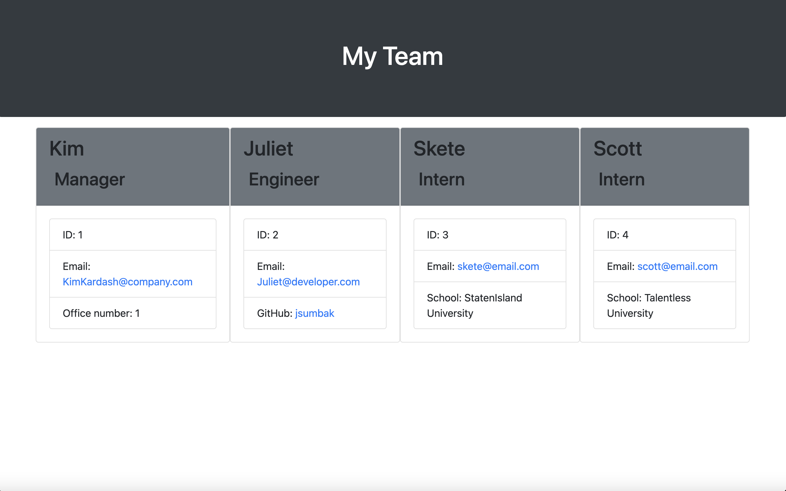

# OOP-Challenge
Object-Oriented Programming Challenge: Team Profile Generator

# Description:
This is a command line application which will take information about employee's on a software engineering team and generate an HTML page which displays brief professional information about each employee.

# Links:
 - Application URL: https://jsumbak.github.io/OOP-Challenge/
 - Video Overview:
 - GitHub Repo: https://github.com/jsumbak/OOP-Challenge

# Visuals
